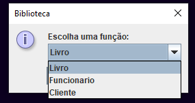
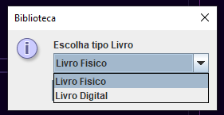
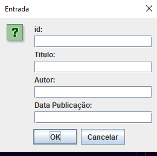
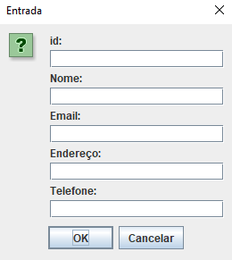
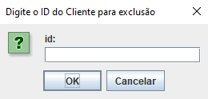
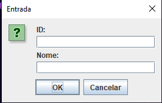

<h1>Sistema CRUD Biblioteca</h1> 

<p align="center">


  
  
   
   
</p>

> Status do Projeto: :heavy_check_mark: :warning: (concluido, em desenvolvimento, etc)

### Tópicos 

:small_blue_diamond: [Descrição do projeto](#descrição-do-projeto)

:small_blue_diamond: [Funcionalidades](#funcionalidades)

:small_blue_diamond: [Demonstração](#deploy-da-aplicação-dash)

:small_blue_diamond: [Pré-requisitos](#pré-requisitos)


## Descrição do projeto 

<p align="justify">
  O Sistema é um CRUD (CREATE, READ, UPDATE, DELETE) de uma biblioteca. Contendo Classes: Livro, Livro Digital, Funcionário e Cliente. O projeto foi desenvolvido utilizando Design Pattern, GRASP e GOF. 
</p>

## Funcionalidades

:heavy_check_mark: Livros
<p align="justify">
A classe Livros possui uma model, um Controller para organizar as funções do CRUD utilizando métodos de Polimorfismo e uma Factory para criação do livro. 
</p>

:heavy_check_mark: Livro Digital
<p align="justify">
É uma subclasse de Livro (Possui Herança), foi criado com o padrão Builder e utiliza do Polimorfismo da Classe Livro para a criação e manipulação do mesmo. 
</p>

:heavy_check_mark: Funcionários
<p align="justify">
Possui a Model de Funcionário e uma classe com o Padrão Singleton onde cria sua instância e é possivel a criação e manipulação do cadastro de funcionários.
</p>

:heavy_check_mark: Clientes
<p align="justify">
Possui a Model de Cliente e um controller com métodos de polimorfismo para manipulação do CRUD. 
</p>

:heavy_check_mark: Interface 
<p align="justify">
A interface está localizada da classe App.java, foi desenvolvida com a biblioteca nativa JAVA SWING (JOptionPane e JTextField) por sua facilidade na implementação e ajuda para realizar os testes.
</p>
<p align="justify">
Os resultados são impressos na aba de execução utilizando-se do System.out.printLn()
</p>


## Layout :dash:








## Pré-requisitos
-Java instalado;

## Como rodar a aplicação :arrow_forward:

No terminal, clone o projeto: 

```
git clone https://github.com/AlvesMatheusO/livrariaArquitetura.git
```

ou

```
git@github.com:AlvesMatheusO/livrariaArquitetura.git
```

Para rodar o projeto vá até a Classe App.java e rode com sua IDE.

